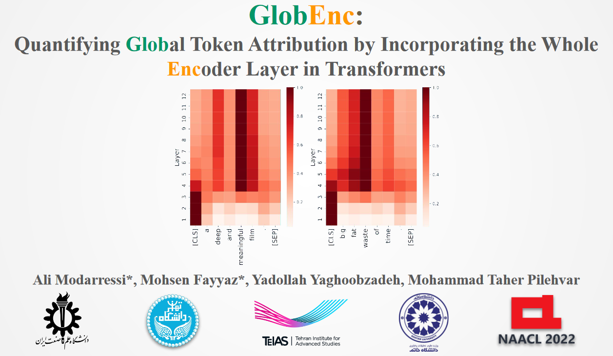

# GlobEnc
[NAACL 2022] GlobEnc: Quantifying Global Token Attribution by Incorporating the Whole Encoder Layer in Transformers <br>
[[📝 Paper]](https://aclanthology.org/2022.naacl-main.19/)
[[🎥 Video]](https://youtu.be/jgd9kUJlug4)

# Web Demo

Integrated into [Huggingface Spaces 🤗](https://huggingface.co/spaces) using [Gradio](https://github.com/gradio-app/gradio). Try out the Web Demo [](https://huggingface.co/spaces/NAACL2022/GlobEnc)

Also check this Colab notebook to see what BERT attends to <a href="https://colab.research.google.com/github/mohsenfayyaz/GlobEnc/blob/main/GlobEnc_Demo.ipynb"></a>


## Abstract
> There has been a growing interest in interpreting the underlying dynamics of Transformers. While self-attention patterns were initially deemed as the primary choice, recent studies have shown that integrating other components can yield more accurate explanations. This paper introduces a novel token attribution analysis method that incorporates all the components in the encoder block and aggregates this throughout layers. We quantitatively and qualitatively demonstrate that our method can yield faithful and meaningful global token attributions. Our extensive experiments reveal that incorporating almost every encoder component results in increasingly more accurate analysis in both local (single layer) and global (the whole model) settings. Our global attribution analysis surpasses previous methods by achieving significantly higher results in various datasets.



## Citation
If you found this work useful, please consider citing our paper:
```bibtex
@inproceedings{modarressi-etal-2022-globenc,
    title = "{G}lob{E}nc: Quantifying Global Token Attribution by Incorporating the Whole Encoder Layer in Transformers",
    author = "Modarressi, Ali  and
      Fayyaz, Mohsen  and
      Yaghoobzadeh, Yadollah  and
      Pilehvar, Mohammad Taher",
    booktitle = "Proceedings of the 2022 Conference of the North American Chapter of the Association for Computational Linguistics: Human Language Technologies",
    month = jul,
    year = "2022",
    address = "Seattle, United States",
    publisher = "Association for Computational Linguistics",
    url = "https://aclanthology.org/2022.naacl-main.19",
    pages = "258--271",
    abstract = "There has been a growing interest in interpreting the underlying dynamics of Transformers. While self-attention patterns were initially deemed as the primary option, recent studies have shown that integrating other components can yield more accurate explanations. This paper introduces a novel token attribution analysis method that incorporates all the components in the encoder block and aggregates this throughout layers. Through extensive quantitative and qualitative experiments, we demonstrate that our method can produce faithful and meaningful global token attributions. Our experiments reveal that incorporating almost every encoder component results in increasingly more accurate analysis in both local (single layer) and global (the whole model) settings. Our global attribution analysis significantly outperforms previous methods on various tasks regarding correlation with gradient-based saliency scores. Our code is freely available at https://github.com/mohsenfayyaz/GlobEnc.",
}
```


<!-- ## Setup
```
conda create -n attention-env
pip install pip-tools
conda install pytorch torchvision torchaudio cudatoolkit=10.2 -c pytorch
```
 -->
